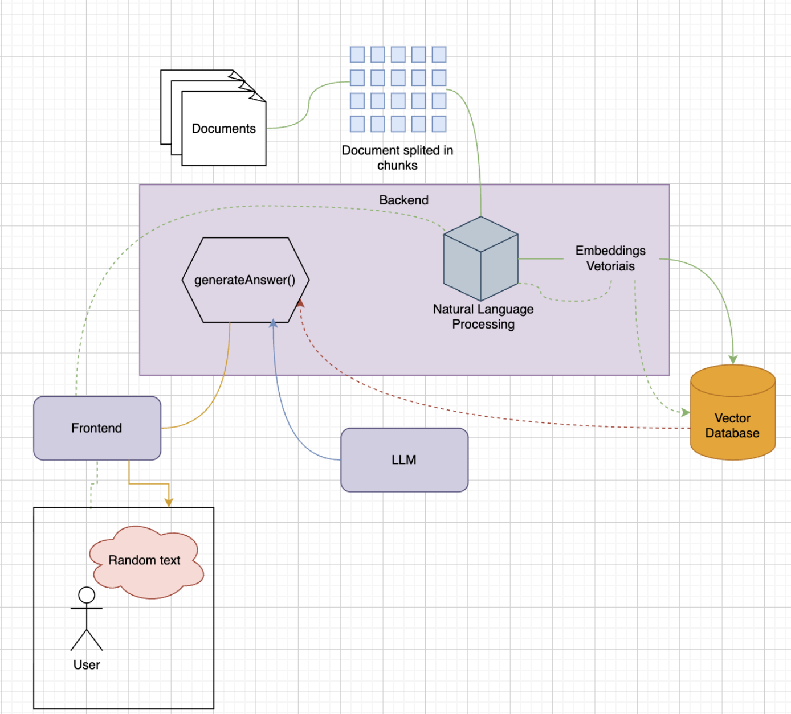
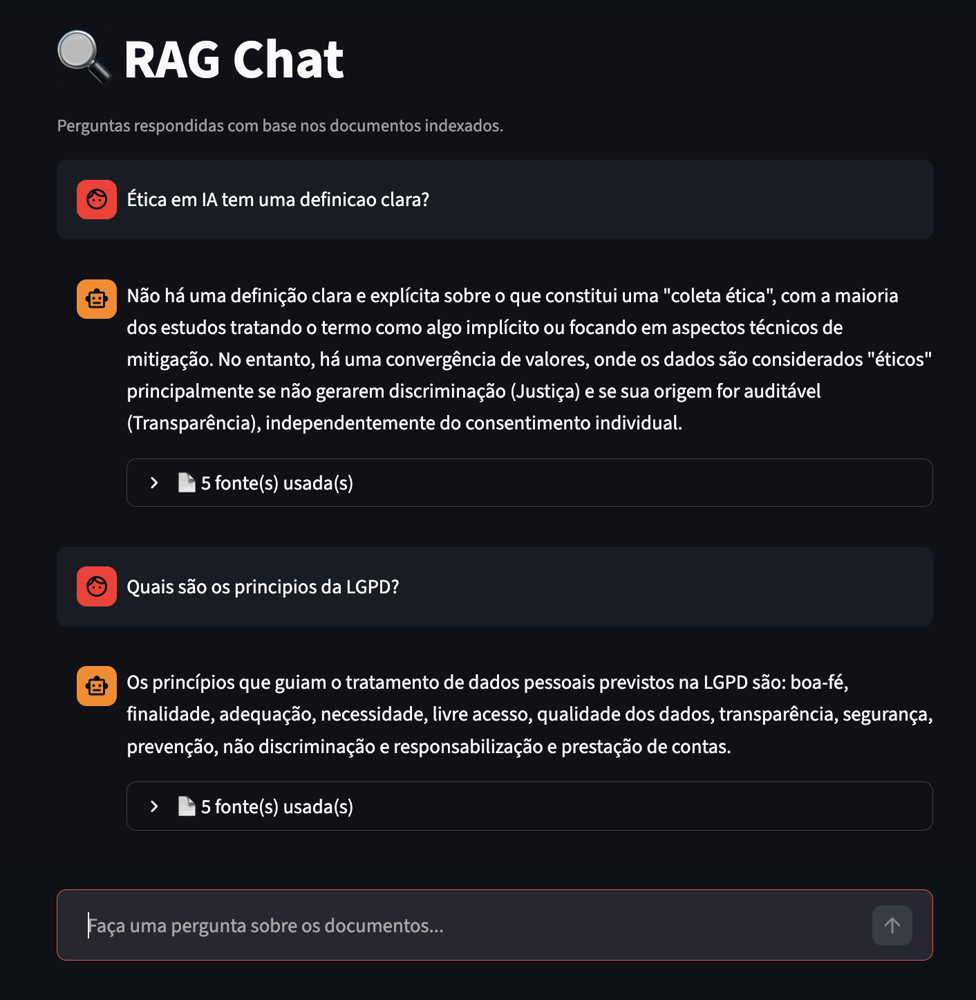
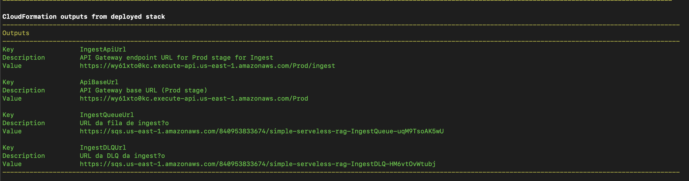
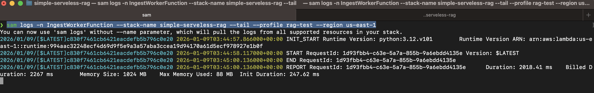
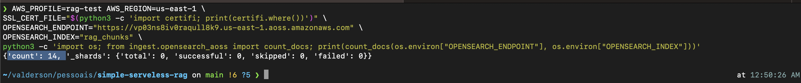

# Simple Serverless RAG

RAG (Retrieval-Augmented Generation) serverless usando OpenSearch para busca vetorial e Gemini/Bedrock para geração de respostas.

## Como funciona

Dois modos de uso: **local** (para desenvolver e testar) e **AWS** (produção serverless).

### Arquitetura geral



### Fluxo de ingestão

1. Um documento de texto é enviado ao sistema
2. O texto é dividido em **chunks** (pedaços menores)
3. Cada chunk vira um **embedding** (vetor numérico que representa o significado do texto)
4. Os chunks + vetores são armazenados no **OpenSearch**

### Fluxo de busca (RAG)

1. O usuário faz uma pergunta no chat
2. A pergunta vira um embedding
3. O OpenSearch encontra os chunks semanticamente mais próximos
4. O LLM (Gemini ou Claude via Bedrock) gera uma resposta baseada nesses chunks
5. A resposta é exibida junto com as fontes usadas



---

## Rodando localmente

### Pré-requisitos

- Docker
- Python 3.12+
- Chave da API do Gemini (`GEMINI_API_KEY`) em `.env`

### 1. Configurar o ambiente

Copie o arquivo de exemplo e preencha as variáveis:

```bash
cp .env.example .env
# edite .env e coloque sua GEMINI_API_KEY
```

### 2. Instalar dependências

```bash
make install
```

Cria o `.venv` e instala todas as dependências (OpenSearch, fastembed, Streamlit, etc).

### 3. Subir a infraestrutura local

```bash
make local-up
```

Sobe o OpenSearch (porta 9200) e o ElasticMQ (porta 9324) via Docker.

### 4. Ingestar documentos

```bash
make ingest FILES="documents/*.txt"
```

Suporta `.txt` e `.md`. Para um arquivo só:

```bash
make ingest FILES="documents/meu-arquivo.txt"
```

O `doc_id` é o nome do arquivo sem extensão. Re-ingestar o mesmo arquivo substitui os chunks anteriores.

### 5. Rodar o chat

```bash
make ui
```

Abre o chat em [http://localhost:8501](http://localhost:8501).

---

## Variáveis de ambiente (`.env`)

| Variável | Descrição | Padrão |
|---|---|---|
| `GEMINI_API_KEY` | Chave da API do Gemini | obrigatório |
| `GEMINI_MODEL_ID` | Modelo Gemini a usar | `gemini-2.5-flash-lite` |
| `OPENSEARCH_ENDPOINT` | Endpoint do OpenSearch | `http://localhost:9200` |
| `OPENSEARCH_INDEX` | Nome do índice | `rag_chunks_local` |
| `OPENSEARCH_AUTH` | Modo de auth (`local` ou `sigv4`) | `local` |
| `EMBEDDING_PROVIDER` | Provider de embeddings (`fastembed`, `local`, `bedrock`, `mock`) | `fastembed` |
| `EMBEDDING_DIM` | Dimensão dos vetores | `384` |
| `LLM_PROVIDER` | Provider do LLM (`gemini` ou `mock`) | `gemini` |

---

## Comandos disponíveis

```bash
make install                         # cria .venv e instala dependências
make local-up                        # sobe OpenSearch + ElasticMQ
make local-down                      # derruba os containers
make ingest FILES="documents/*.txt"  # indexa documentos
make ui                              # abre o chat
make test                            # roda os testes unitários
make lint                            # verifica o código com ruff
make format                          # formata o código com ruff
```

---

## Providers de embedding

| Provider | Quando usar |
|---|---|
| `fastembed` | Local, sem cloud, semântica real (recomendado para dev) |
| `local` | `sentence-transformers` local, requer PyTorch |
| `bedrock` | AWS Bedrock (Titan Embeddings), requer credenciais AWS |
| `mock` | Vetores aleatórios, só para testar o encanamento |

O modelo padrão do `fastembed` é `BAAI/bge-small-en-v1.5` (~67MB, baixado automaticamente na primeira execução).

---

## Estrutura do projeto

```
.
├── ask/              # Lambda: recebe pergunta, busca chunks, gera resposta
├── ingest/           # Lambda: recebe documento e enfileira no SQS
├── ingest_worker/    # Lambda: processa fila, gera embeddings e indexa
├── query/            # Lambda: busca vetorial sem geração de resposta
├── shared/           # Layer compartilhado: OpenSearch client + embeddings
├── ui/               # Chat Streamlit (interface local)
├── script/           # Scripts utilitários (ingestão local de arquivos)
├── documents/        # Documentos de exemplo para ingestar
├── tests/            # Testes unitários e de integração
├── template.yaml     # SAM template (deploy AWS)
└── docker-compose.yml
```

---

## Deploy AWS (produção)

O projeto é serverless via AWS SAM: API Gateway + Lambda + SQS + OpenSearch Serverless (AOSS) + Bedrock.

```bash
make build
make deploy
```

Na AWS, os embeddings são gerados pelo **Bedrock Titan Embeddings V2** e o LLM é o **Claude via Bedrock**.

Para usar o deploy AWS, configure `OPENSEARCH_AUTH=sigv4` e aponte `OPENSEARCH_ENDPOINT` para o endpoint AOSS.

### Evidências do deploy




